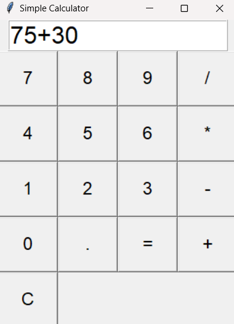

# calculator

## Calculator Application
Description
A calculator application is a software tool designed to perform mathematical operations, ranging from basic arithmetic to complex calculations. It is an essential utility for students, professionals, and anyone needing quick and accurate computations.

## Key Features
1. Basic Operations
Addition, subtraction, multiplication, and division.
2. Advanced Mathematical Functions
Square root, exponents, logarithms, and trigonometric functions (sin, cos, tan).
Support for percentages and factorials.
3. Scientific Mode
Advanced calculations, including engineering functions, radians/degrees mode, and constants like π and e.
4. Programmer Mode
Binary, octal, decimal, and hexadecimal conversions.
Bitwise operations (AND, OR, XOR).
5. Graphing Mode (Optional)
Plot functions on a 2D or 3D graph.
Interactive zoom and pan capabilities for detailed views.
6. Memory Functions
Save and recall numbers for repeated use.
Memory clear and cumulative addition/subtraction.
7. Customization
Change themes (light/dark mode).
Configurable settings for precision and display format (e.g., scientific notation).
8. History and Replay
View a log of previous calculations.
Replay or edit previous entries.
9. Multi-Platform Compatibility
Accessible on mobile, desktop, and web platforms.

 ## How It Works
User Interface (UI):

A clean and intuitive UI with buttons for numbers, operations, and modes.
Input numbers using on-screen buttons or a physical keyboard.
Input Parsing:

The application interprets user input to determine the operation and validates it for correctness.
Calculation Engine:

Performs the requested operation using efficient algorithms to ensure quick and accurate results.
Output Display:

Displays the result on the screen, with an option to copy it to the clipboard.
Modes and Features:

Switch between basic, scientific, and programmer modes as needed.
History enables reviewing and reusing past calculations.
Error Handling:

